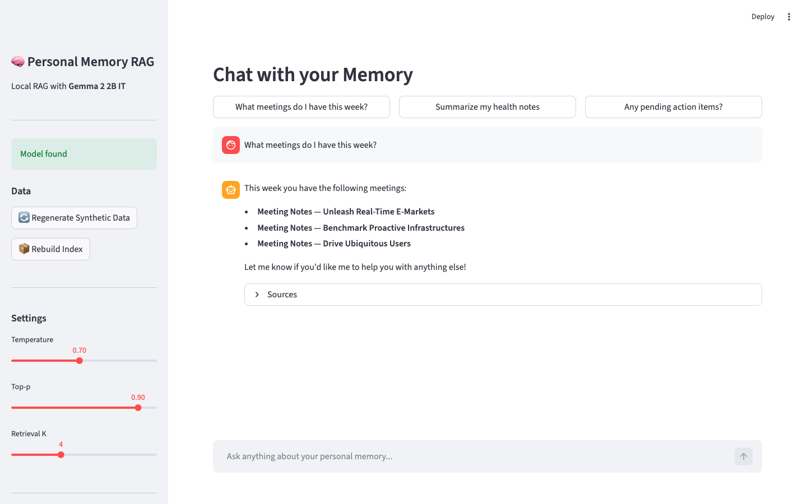
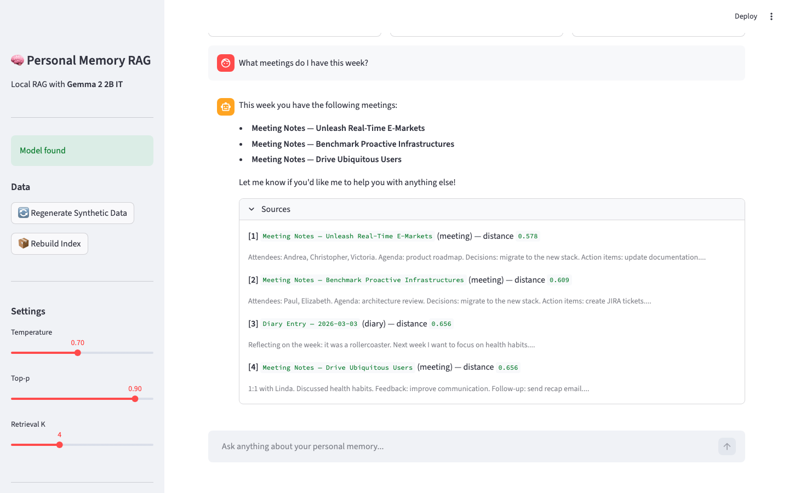

# 🧠 Personal Memory RAG

A fully local **Retrieval-Augmented Generation (RAG)** system that ingests synthetic mixed personal + document data, retrieves relevant context, and answers queries using **Google Gemma 2 2B IT** running on your own hardware. Built with Python, ChromaDB, Sentence-Transformers, and Streamlit.



---

## ✨ Features

- 🔒 **100% Local** — No API keys, no cloud dependencies. Everything runs on your machine.
- 🤖 **Gemma 2 2B IT** — Lightweight but capable LLM via `llama-cpp-python` with Metal GPU support on Apple Silicon.
- 📚 **Mixed Synthetic Data** — 50 auto-generated documents spanning diary entries, meeting notes, emails, reminders, and articles.
- 🔍 **Semantic Search** — `all-MiniLM-L6-v2` embeddings stored in persistent ChromaDB with cosine similarity.
- 💬 **Streamlit Chat UI** — Clean chat interface with expandable source citations and hyperparameter tuning.
- 📸 **Screenshot Automation** — Playwright-powered screenshot pipeline for documentation.
- ✅ **Smoke Tests** — pytest coverage for data, embeddings, vector store, and generation.

---

## 🏗 Architecture

```
┌─────────────────┐      ┌──────────────────┐      ┌─────────────────┐
│  Streamlit App  │─────▶│   RAG Engine     │─────▶│ ChromaDB Store  │
│  (chat + docs)  │      │ (retrieval + gen)│      │  (embeddings)   │
└─────────────────┘      └──────────────────┘      └─────────────────┘
                                │
                                ▼
                        ┌──────────────────┐
                        │ llama-cpp-python │
                        │ gemma-2-2b-it Q4 │
                        │   (Metal/GPU)    │
                        └──────────────────┘
```

| Component | Technology |
|-----------|------------|
| LLM | [Gemma 2 2B IT](https://huggingface.co/google/gemma-2-2b-it) (GGUF Q4_K_M) |
| Embeddings | `sentence-transformers/all-MiniLM-L6-v2` (384-dim) |
| Vector DB | ChromaDB (persistent, file-based) |
| Web UI | Streamlit |
| Data Gen | Faker + structured templates |
| Screenshot | Playwright |
| Tests | pytest |

---

## 🚀 Quick Start

### 1. Clone & Setup

```bash
git clone git@github.com:sahooamita/RAG-agentic-personal-memory.git
cd RAG-agentic-personal-memory
bash scripts/setup.sh
```

This creates a Python venv, installs dependencies, downloads the ~1.5 GB Gemma 2 2B IT GGUF model, and verifies it loads.

### 2. Build the Index

```bash
source .venv/bin/activate
python scripts/build_index.py
```

Generates 50 synthetic documents and indexes them into ChromaDB (54 chunks).

### 3. Launch the App

```bash
streamlit run app/streamlit_app.py
```

Then open [http://localhost:8501](http://localhost:8501).

### 4. Take Screenshots (optional)

```bash
python scripts/take_screenshots.py
```

Saves PNGs to `screenshots/`.

### 5. Run Tests

```bash
pytest tests/test_rag.py -v
```

---

## 📸 Screenshots

### Chat with Source Citations


### Sidebar Settings


---

## 📁 Project Structure

```
.
├── README.md
├── requirements.txt
├── data/
│   ├── synthetic_corpus.json      # Generated documents
│   └── demo_result.json           # Showcase conversation
├── src/
│   ├── config.py                  # Paths & hyperparameters
│   ├── data_generator.py          # Synthetic data factory
│   ├── embedder.py                # SentenceTransformer wrapper
│   ├── vector_store.py            # ChromaDB wrapper
│   ├── model_loader.py            # llama-cpp model loader
│   └── rag_engine.py              # Retrieval + generation pipeline
├── app/
│   └── streamlit_app.py           # Main web UI
├── scripts/
│   ├── setup.sh                   # One-shot environment setup
│   ├── build_index.py             # Generate data + build index
│   └── take_screenshots.py        # Playwright automation
├── tests/
│   └── test_rag.py                # pytest smoke tests
└── screenshots/
    ├── 01_landing.png
    ├── 02_chat_with_sources.png
    └── 03_sidebar_settings.png
```

---

## ⚙️ Configuration

Key settings live in `src/config.py`:

| Setting | Default | Description |
|---------|---------|-------------|
| `EMBEDDING_MODEL` | `all-MiniLM-L6-v2` | Embedding model name |
| `LLM_MODEL_PATH` | `models/gemma-2-2b-it-Q4_K_M.gguf` | Local GGUF path |
| `CHUNK_SIZE` | 300 | Character chunk size |
| `CHUNK_OVERLAP` | 50 | Overlap between chunks |
| `DEFAULT_RETRIEVAL_K` | 4 | Top-K retrieved chunks |
| `DEFAULT_TEMPERATURE` | 0.7 | LLM temperature |
| `DEFAULT_TOP_P` | 0.9 | LLM nucleus sampling |

---

## 🖥 Hardware Notes

Developed and tested on **Apple M1 Pro (10-core, 16 GB RAM)**.

- `llama-cpp-python` automatically offloads all layers to Metal (`n_gpu_layers=-1`) on Apple Silicon.
- FP16/CPU fallback is available if Metal is unavailable.
- Total memory footprint: ~2 GB (model + embeddings + ChromaDB).

---

## 📝 License

MIT — feel free to fork, extend, and experiment.

---

## 🙋‍♀️ Issues & Roadmap

See the [GitHub Issues](https://github.com/sahooamita/RAG-agentic-personal-memory/issues) tab for the full development roadmap, including:

1. Bootstrap environment & model download
2. Synthetic data generation
3. Chunking, embedding, and vector store
4. Local LLM integration
5. Streamlit UI with citations
6. Screenshot automation & README
7. pytest smoke tests
